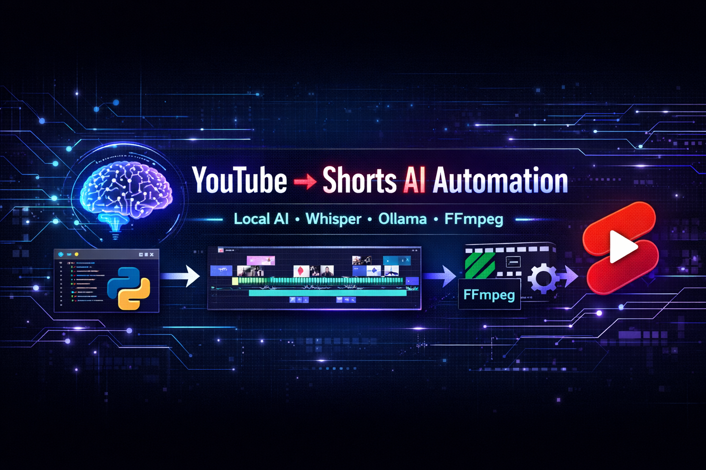
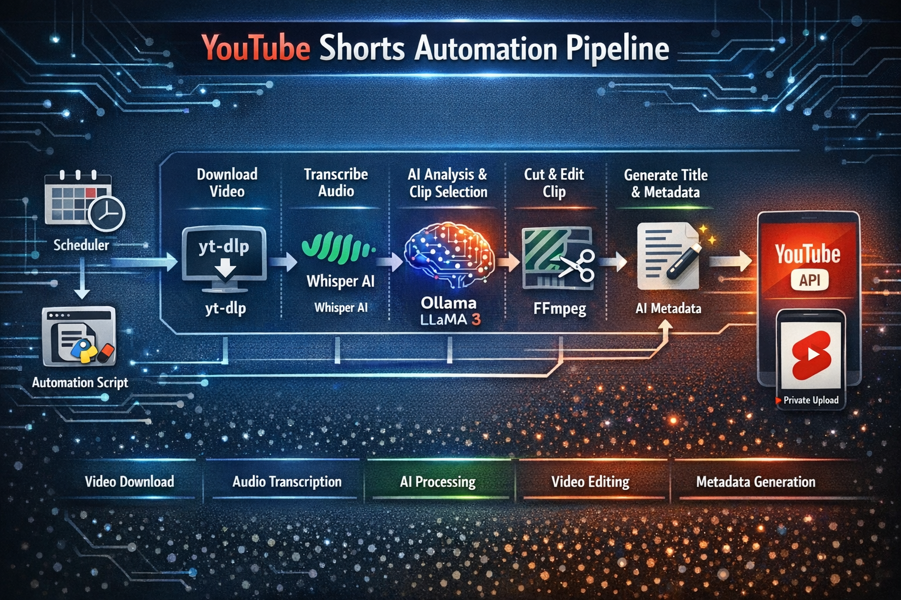
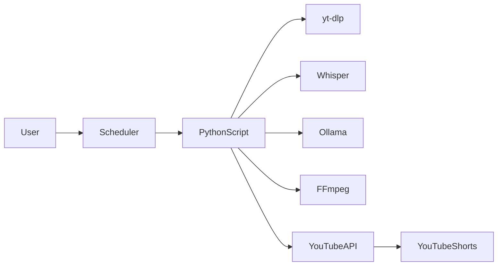
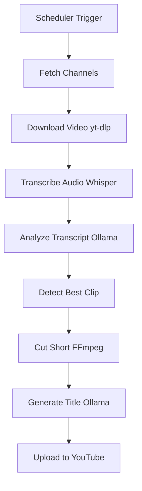

# 🎬 YouTube → Shorts AI Automation
<p align="center">

</p>
<p align="center">


</p>

<p align="center">

🚀 **Fully automated AI pipeline that converts long YouTube videos into Shorts and uploads them automatically.**

</p>

---

## 📚 Table of Contents

- [Overview](#Overview)
- [Features](#features)
- [Demo](#demo)
- [AI Stack](#ai-stack)
- [System Architecture](#system-architecture)
- [Pipeline Workflow](#pipeline-workflow)
- [Project Structure](#project-structure)
- [Requirements](#requirements)
- [Installation](#installation)
- [Google API Setup](#google-api-setup)
- [Add YouTube Cookies](#add-youtube-cookies)
- [Add Channels](#add-channels)
- [Running the Pipeline](#running-the-pipeline)
- [Automation with Task Scheduler](#automation-with-task-scheduler)
- [Output Files](#output-files)
- [Example Generated Short](#example-generated-short)
- [Future Improvements](#future-improvements)
- [FAQ](#faq)
- [Contributing](#contributing)
- [Star History](#star-history)
- [License](#license)

---

## Overview

This project is an **AI-powered YouTube automation pipeline** that:

1. Fetches videos from YouTube channels
2. Downloads them automatically
3. Transcribes the audio using **Whisper AI**
4. Uses **Ollama (Llama3)** to detect the best moments
5. Cuts clips using **FFmpeg**
6. Generates titles automatically
7. Uploads the clips to YouTube as **Shorts**

Everything runs **locally on your machine**.

No paid APIs.
No external AI services.

---

<p align="center">

</p>


## Features

- Automatic video downloading
- AI transcript generation using **Whisper**
- Local AI clip detection with **Ollama Llama3**
- Automatic video clipping using **FFmpeg**
- AI-generated titles and metadata
- Uploads directly to YouTube
- Fully automated using **Windows Task Scheduler**
- Supports **100+ channels**
- Runs **100% locally**

---

## Demo

Example scheduler output:

```
🎬 YouTube to Shorts — Auto Scheduler

Loaded 1 channel(s)
Videos processed so far: 3

📥 Downloading video
Title: Can 5 Girls Impress This One Guy?

🎙️ Transcribing with Whisper...
Detected language: Hindi
Transcribed 265 segments

🤖 Asking Ollama to find clip moments...

✂️ Cutting: 30s → 85s
Saved: short_01.mp4

📝 Generating metadata...

📤 Uploading Short...
Uploaded! https://youtube.com/shorts/YRuYCnzhrY8

✅ DONE
```

---

## AI Stack

| Tool       | Purpose                           |
| ---------- | --------------------------------- |
| Whisper    | Speech-to-text transcription      |
| Ollama     | Local LLM runtime                 |
| Llama3.2   | Clip detection + title generation |
| FFmpeg     | Video processing                  |
| yt-dlp     | YouTube downloading               |
| Google API | Upload Shorts                     |

---

## Architecture



---

## Pipeline Workflow



---

## Project Structure

```
Main_Folder/
│
├── yts_ollama.py        # Main pipeline script
├── scheduler.py             # Scheduler controller
├── run_shorts.bat           # Windows automation runner
│
├── channels.txt             # Channel list
├── cookies.txt              # YouTube cookies
│
├── client_secret.json       # Google API credentials
├── youtube_token.json       # OAuth token
│
└── shorts_output/           # Generated shorts
```

---

## Installation

### Install Python dependencies

```
pip install yt-dlp
pip install openai-whisper
pip install google-api-python-client
pip install google-auth-httplib2
pip install google-auth-oauthlib
```

---

### Install FFmpeg

Download from:

[https://ffmpeg.org/download.html](https://ffmpeg.org/download.html)

Add FFmpeg to system **PATH**.

---

### Install Ollama

Download:

[https://ollama.com](https://ollama.com)

Run model:

```
ollama run llama3.2
```

---

## Google API Setup

1. Go to **Google Cloud Console**
2. Enable **YouTube Data API v3**
3. Create OAuth credentials
4. Download credentials JSON

Save as:

```
client_secret.json
```

First run generates:

```
youtube_token.json
```

---

## Add YouTube Cookies

Some videos require login.

Export cookies using browser extension:

**Get cookies.txt**

Save as:

```
cookies.txt
```

---

## Add Channels

Edit:

```
channels.txt
```

Example:

```
https://www.youtube.com/@BBKiVines/videos
https://www.youtube.com/@CarryMinati/videos
https://www.youtube.com/@FilterCopy/videos
```

Supports **100+ channels**.

---

## Running the Pipeline

Run manually:

```
python scheduler.py
```

---

## Automate with Windows Task Scheduler

Create batch file:

```
run_shorts.bat
```

```
@echo off
cd <folder_path>
python scheduler.py
```

Create tasks:

| Task    | Time    |
| ------- | ------- |
| Morning | 9:00 AM |
| Evening | 9:00 PM |

Program:

```
run_shorts.bat
```

---

## Output Files

Generated shorts stored in:

```
shorts_output/
```

Example:

```
shorts_output/
   └── NPsfgznkTBA/
        ├── short_01.mp4
        ├── results.json
        └── transcript.txt
```

---

## Example Generated Short

Title:

```
😍 Can 5 Girls Impress Him? 🤔
```

Duration:

```
55 seconds
```

Video:

```
https://youtube.com/shorts/YRuYCnzhrY8
```

---

## Future Improvements

Planned upgrades:

* Auto captions for Shorts
* AI vertical cropping
* Thumbnail generator
* Multi-channel upload
* n8n workflow integration
* Automatic posting schedule
* Viral clip detection

---

## Contributing

Contributions are welcome!

Steps:

1. Fork the repository
2. Create a new branch
3. Commit your changes
4. Open a Pull Request

---

## Support

If you like this project:

⭐ Star the repository
🍴 Fork it
🧠 Share improvements

---

## License

MIT License

---

## Acknowledgements

Libraries used:

* yt-dlp
* openai-whisper
* FFmpeg
* Ollama
* google-api-python-client
